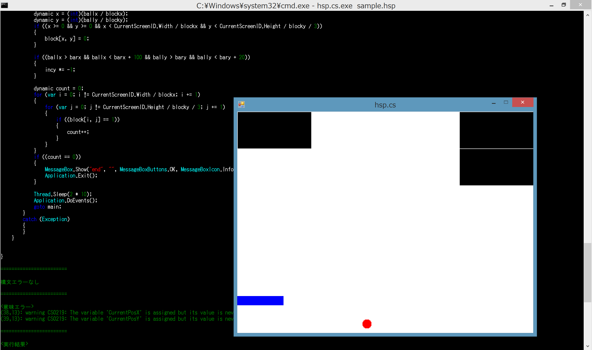

# hsp.cs
HSPのコードをC#に変換し, 実行します  

## LICENSE
[The MIT License](https://github.com/kkrnt/hsp.cs/blob/master/LICENSE)

## Download
[v0.2.0](https://github.com/kkrnt/hsp.cs/releases/tag/v0.2.0)  
[v0.1.6](https://github.com/kkrnt/hsp.cs/releases/tag/v0.1.6)  
[v0.1.5](https://github.com/kkrnt/hsp.cs/releases/tag/v0.1.5)  
[v0.1.4](https://github.com/kkrnt/hsp.cs/releases/tag/v0.1.4)  
[v0.1.3](https://github.com/kkrnt/hsp.cs/releases/tag/v0.1.3)  
[v0.1.2](https://github.com/kkrnt/hsp.cs/releases/tag/v0.1.2)  
[v0.1.1](https://github.com/kkrnt/hsp.cs/releases/tag/v0.1.1)  
[v0.1.0](https://github.com/kkrnt/hsp.cs/releases/tag/v0.1.0)  

## Usage
```
hsp.cs      [.hsp] [option]

Option:
     -o  --output <file>       output executive file(.exe)
     -c  --cs     <file>       output csharp source file(.cs)
Example:
     hsp.cs.exe sample.hsp
     hsp.cs.exe sample.hsp -o sample.exe -c sample.cs
```

## Basic Grammar
- if
- else
- for
- next
- while
- wend
- repeat
- loop
- switch
- swend
- swbreak
- case
- default
- _break
- _continue
- goto
- gosub

## Function
- int
- double
- str
- abs
- absf
- sin
- cos
- tan
- atan
- expf
- logf
- powf
- sqrt
- instr
- strlen
- limit
- limitf
- length
- length2
- length3
- length4
- gettime
- deg2rad
- rad2deg
- strmid
- strtrim
- rnd

## Command
- print
- mes
- exist
- delete
- mkdir
- split
- bcopy
- strrep
- dim
- ddim
- chdir
- ginfo_mx
- ginfo_my
- end
- stop
- screen
- title
- circle
- boxf
- pos
- line
- color
- wait
- objsize
- dialog

## Macro
- M_PI
- and
- not
- or
- xor
- mousex
- mousey
- dir_desktop
- dir_exe
- dir_mydoc
- dir_sys
- dir_win
- dir_cur
- ginfo_sizex
- ginfo_sizey
- ginfo_r
- ginfo_g
- ginfo_b
- ginfo_cx
- ginfo_cy
- ginfo_dispx
- ginfo_dispy
- ginfo_wx1
- ginfo_wx2
- ginfo_wy1
- ginfo_wy2
- ginfo_sel
- hwnd
- __date__
- __time__

## Example
<a href="http://o8o.jp/hsp.cs.mp4></a>  
```
hsp.cs.exe sample.hsp

<HSP Code>
screen 0, 640, 480

blockx = 160
blocky = 80
dim block, ginfo_sizex/blockx, ginfo_sizey/blocky/3
for i, 0, ginfo_sizex/blockx, 1
        for j, 0, ginfo_sizey/blocky/3, 1
                block(i, j) = 1
        next
next

ballx = 400
bally = 400

incx = 10
incy = 10

barx = 0
bary = 400
barinc = 25

*main
        color 255, 255, 255
        boxf

        color 0, 0, 0
        for i, 0, ginfo_sizex/blockx, 1
                for j, 0, ginfo_sizey/blocky/3, 1
                        if(block(i, j) == 1){
                                boxf i*blockx+1, j*blocky+1, (i+1)*blockx-2, (j+1)*blocky-2
                        }
                next
        next

        color 255, 0, 0
        circle ballx, bally, ballx + 20, bally + 20

        ballx += incx
        bally += incy

        color 0, 0, 255
        boxf barx, bary, barx + 100, bary + 20

        getkey right, 37
        getkey left, 39
        if(left == 1){
                barx += barinc
        }
        if(right == 1){
                barx -= barinc
        }

        if(ballx + 20 > ginfo_sizex || ballx < 20){
                incx *= -1
        }
        if(bally + 20 > ginfo_sizey || bally < 20){
                incy *= -1
        }

        x = int(ballx / blockx)
        y = int(bally / blocky)
        if(x >= 0 && y >= 0 && x < ginfo_sizex/blockx && y < ginfo_sizey/blocky/3){
                block(x, y) = 0
        }

        if(ballx > barx && ballx < barx + 100 && bally > bary && bally < bary + 20){
                incy *= -1
        }

        count = 0
        for i, 0, ginfo_sizex/blockx, 1
                for j, 0, ginfo_sizey/blocky/3, 1
                        if(block(i, j) == 1){
                                count++
                        }
                next
        next
        if(count == 0){
                dialog "end"
                end
        }

        wait 2
goto *main

========================
```
```cs
<C# Code>
using System;
using System.Drawing;
using System.Windows.Forms;
using System.Runtime.InteropServices;
using System.Threading;
public class Program
{
    public static Form form0 = new Form();
    public static Form CurrentScreenID = form0;
    public static Program program = new Program();
    [DllImport("user32.dll")]
    private static extern ushort GetAsyncKeyState(int vKey);

    public static void Main()
    {
        program.initScreen(form0);
        Application.Run(form0);
    }

    public void initScreen(Form form)
    {
        form.ClientSize = new Size(640, 480);
        form.Text = "hsp.cs";
        form.BackColor = Color.FromArgb(255, 255, 255);
        form.MaximizeBox = false;
        form.FormBorderStyle = FormBorderStyle.FixedSingle;
        form.Paint += paint;
    }

    public void screen(Form form, int width, int height)
    {
        form.ClientSize = new Size(width, height);
    }

    public void paint(object sender, PaintEventArgs e)
    {
        var FontSize = 14;
        var CurrentPosX = 0;
        var CurrentPosY = 0;
        Graphics g = e.Graphics;
        Brush brush = new SolidBrush(Color.FromArgb(0, 0, 0));
        Pen pen = new Pen(Color.FromArgb(0, 0, 0));
        Font font = new Font("MS ゴシック", FontSize);
        try
        {
            program.screen(form0, 640, 480);

            dynamic blockx = 160;
            dynamic blocky = 80;
            dynamic block = new dynamic[CurrentScreenID.Width / blockx, CurrentScreenID.Height / blocky / 3];
            for (var i = 0; i != CurrentScreenID.Width / blockx; i += 1)
            {
                for (var j = 0; j != CurrentScreenID.Height / blocky / 3; j += 1)
                {
                    block[i, j] = 1;
                }
            }

            dynamic ballx = 400;
            dynamic bally = 400;

            dynamic incx = 10;
            dynamic incy = 10;

            dynamic barx = 0;
            dynamic bary = 400;
            dynamic barinc = 25;

        main:
            brush = new SolidBrush(Color.FromArgb(255, 255, 255));
            pen = new Pen(Color.FromArgb(255, 255, 255));
            g.FillRectangle(brush, 0, 0, CurrentScreenID.Width, CurrentScreenID.Height);

            brush = new SolidBrush(Color.FromArgb(0, 0, 0));
            pen = new Pen(Color.FromArgb(0, 0, 0));
            for (var i = 0; i != CurrentScreenID.Width / blockx; i += 1)
            {
                for (var j = 0; j != CurrentScreenID.Height / blocky / 3; j += 1)
                {
                    if ((block[i, j] == 1))
                    {
                        g.FillRectangle(brush, i * blockx + 1, j * blocky + 1, (i + 1) * blockx - 2 - i * blockx + 1, (j + 1) * blocky - 2 - j * blocky + 1);
                    }
                }
            }

            brush = new SolidBrush(Color.FromArgb(255, 0, 0));
            pen = new Pen(Color.FromArgb(255, 0, 0));
            g.FillEllipse(brush, ballx, bally, ballx + 20 - ballx, bally + 20 - bally);

            ballx += incx;
            bally += incy;

            brush = new SolidBrush(Color.FromArgb(0, 0, 255));
            pen = new Pen(Color.FromArgb(0, 0, 255));
            g.FillRectangle(brush, barx, bary, barx + 100 - barx, bary + 20 - bary);

            dynamic right = GetAsyncKeyState(37) >> 15;
            dynamic left = GetAsyncKeyState(39) >> 15;
            if ((left == 1))
            {
                barx += barinc;
            }
            if ((right == 1))
            {
                barx -= barinc;
            }

            if ((ballx + 20 > CurrentScreenID.Width || ballx < 20))
            {
                incx *= -1;
            }
            if ((bally + 20 > CurrentScreenID.Height || bally < 20))
            {
                incy *= -1;
            }

            dynamic x = (int)(ballx / blockx);
            dynamic y = (int)(bally / blocky);
            if ((x >= 0 && y >= 0 && x < CurrentScreenID.Width / blockx && y < CurrentScreenID.Height / blocky / 3))
            {
                block[x, y] = 0;
            }

            if ((ballx > barx && ballx < barx + 100 && bally > bary && bally < bary + 20))
            {
                incy *= -1;
            }

            dynamic count = 0;
            for (var i = 0; i != CurrentScreenID.Width / blockx; i += 1)
            {
                for (var j = 0; j != CurrentScreenID.Height / blocky / 3; j += 1)
                {
                    if ((block[i, j] == 1))
                    {
                        count++;
                    }
                }
            }
            if ((count == 0))
            {
                MessageBox.Show("end", "", MessageBoxButtons.OK, MessageBoxIcon.Information);
                Application.Exit();
            }

            Thread.Sleep(2 * 10);
            Application.DoEvents();
            goto main;
        }
        catch (Exception)
        {
        }
    }


}
```
```
========================

構文エラーなし

========================

<意味エラー>
(38,13): warning CS0219: The variable 'CurrentPosX' is assigned but its value is never used
(39,13): warning CS0219: The variable 'CurrentPosY' is assigned but its value is never used

========================

<実行結果>

========================
```